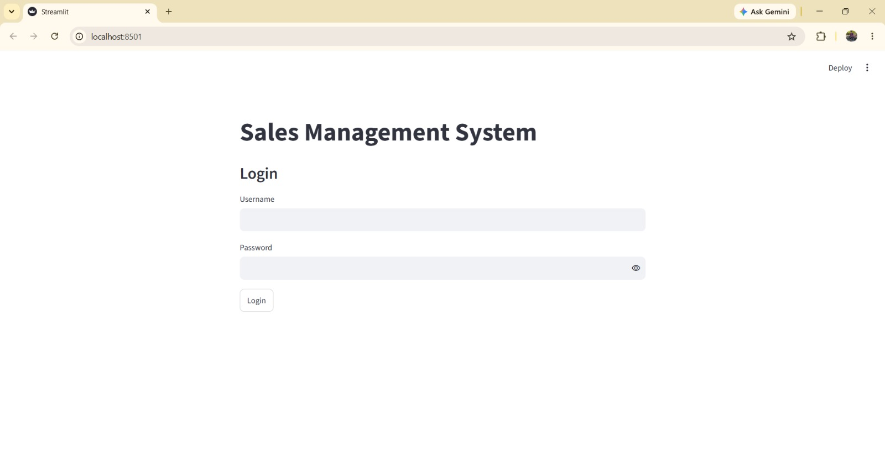
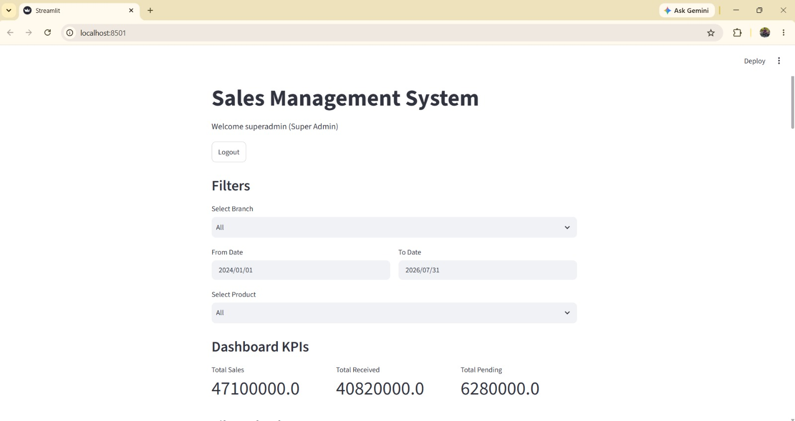
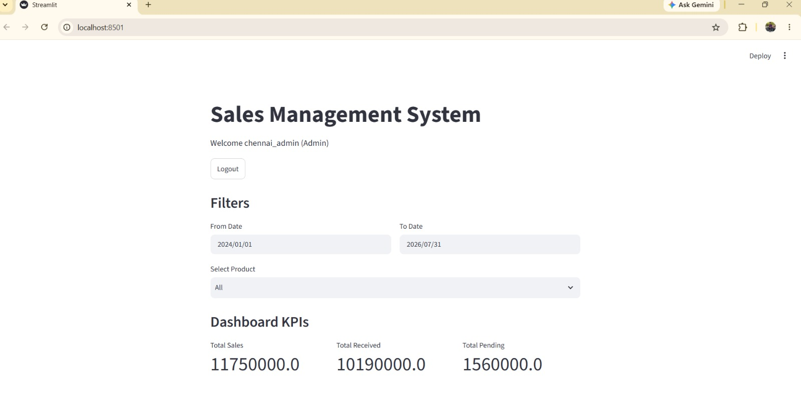
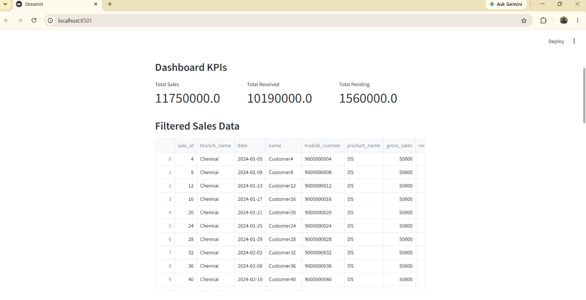
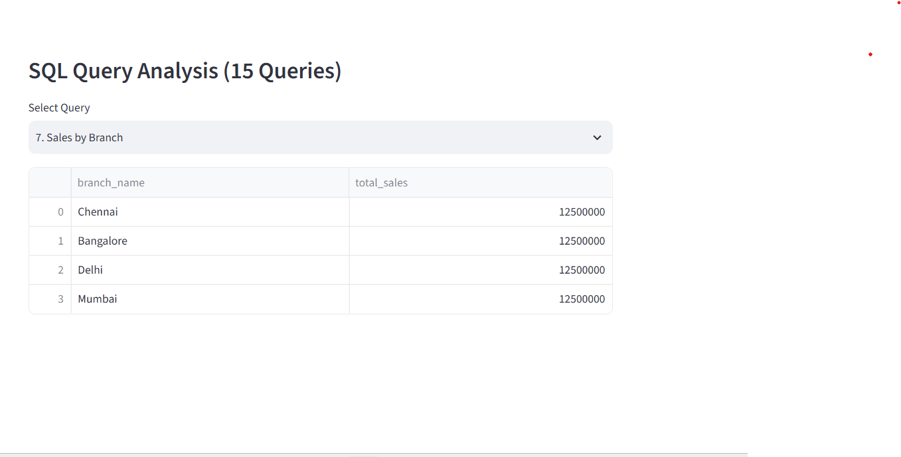

# 🧾 Sales Management System

A role-based sales & payment tracking dashboard built with **Streamlit + MySQL**, supporting multi-branch operations, live KPIs, and an embedded SQL analytics explorer.

🔗 **Live Demo:** _add your Streamlit Cloud link here after deploying_



---

## 📌 Problem Statement

Multi-branch retail businesses need a way to track sales, payments, and outstanding dues per branch — while giving branch admins visibility only into their own branch, and a Super Admin a consolidated view across all branches. This project builds that system end-to-end: schema design, business logic, and an interactive dashboard.

---

## 🚀 Key Features

**Authentication & Access Control**
- Role-based login (`Super Admin` vs `Admin`)
- Super Admin views all branches; Admin is scoped to their own branch automatically

**Sales Dashboard**
- Branch / date-range / product filters
- Live KPIs: Total Sales, Total Received, Total Pending
- Filtered data table with CSV export

**Data Entry**
- Add Customer form (creates a new sale record)
- Add Payment form (records partial/full payments against a sale)

**Automated Business Logic (MySQL)**
- `pending_amount` is a **generated column** (`gross_sales - received_amount`), always in sync — no manual calculation
- A MySQL **trigger** automatically recalculates `received_amount` and flips `status` (`Open` → `Close`) whenever a payment is inserted

**SQL Analytics Explorer**
- 15 pre-built analytical queries selectable from the dashboard — branch-wise sales, top customers, payment method breakdown, date-filtered views, and more

---

## 📸 Screenshots

**Super Admin view** — consolidated KPIs across all branches


**Branch Admin view** — scoped automatically to the logged-in branch, no branch selector shown


**Filtered sales data table** with CSV export


**SQL Query Analysis Explorer** — 15 pre-built analytical queries run on demand


---

## 🛠 Tech Stack

`Python` · `Streamlit` · `MySQL` · `Pandas` · `mysql-connector-python`

---

## 🗄️ Database Design

```
branches           users                customer_sales              payment_splits
─────────           ─────                ──────────────              ───────────────
branch_id (PK)  ←── branch_id (FK)   ←── branch_id (FK)          ┌── sale_id (FK)
branch_name         username            sale_id (PK)             │   payment_id (PK)
branch_admin_name   role                gross_sales               │   amount_paid
                     email               received_amount ◄────────┘   payment_method
                                         pending_amount (generated)    payment_date
                                         status (auto via trigger)
```

- `payment_splits` inserts trigger a recalculation of `received_amount` and `status` on the parent `customer_sales` row — so the dashboard never shows stale payment data
- `idx_sale_id` index on `payment_splits` for faster joins

---

## 📁 Project Structure

```
sales-management-system/
├── data/
│   ├── branches.csv
│   ├── customer_sales.csv
│   └── payment_splits.csv
├── docs/
│   ├── Sales Management System Presentation.pptx
│   └── Sales Management System.docx.pdf
├── db/
│   └── schema.sql
├── screenshots/
│   ├── login.jpeg
│   ├── dashboard_superadmin.jpeg
│   ├── dashboard_branch_admin.jpeg
│   ├── filtered_data_table.jpeg
│   └── sql_query_explorer.png
├── app.py
├── db.py
├── requirements.txt
├── .env.example
├── .gitignore
└── README.md
```

---

## ⚙️ How to Run

**1. Clone and install dependencies**
```bash
git clone https://github.com/meetthaheerhere-ds/sales-management-system.git
cd sales-management-system
pip install -r requirements.txt
```

**2. Set up the database**
```bash
mysql -u root -p < db/schema.sql
```

**3. Configure your database credentials**

Copy `.env.example` to `.env` and fill in your own MySQL credentials — never commit real credentials to GitHub.
```bash
cp .env.example .env
```

**4. Run the app**
```bash
streamlit run app.py
```

---

## 🎯 Project Outcome

- Designed a normalized 4-table relational schema with a generated column and an update trigger
- Built role-based access control into a Streamlit application
- Delivered a live KPI dashboard with dynamic filtering
- Implemented a 15-query SQL analytics explorer for ad-hoc business reporting

---

## 📌 Future Enhancements

- Replace hardcoded `sale_id` generation logic with an auto-increment column to avoid race conditions on concurrent inserts
- Add password hashing instead of plaintext password comparison
- Deploy on Streamlit Cloud with a managed MySQL instance (e.g. PlanetScale, Railway)

---

## 👨‍💻 Author

Thaheer
